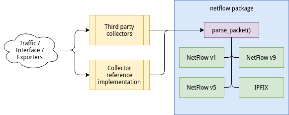

# Python NetFlow/IPFIX library
This package contains libraries and tools for **NetFlow versions 1, 5 and 9, and IPFIX**.

Version 9 is the first NetFlow version using templates. Templates make dynamically sized and configured NetFlow data flowsets possible, which makes the collector's job harder. The library provides the `netflow.parse_packet()` function as the main API point (see below). By importing `netflow.v1`, `netflow.v5` or `netflow.v9` you have direct access to the respective parsing objects, but at the beginning you probably will have more success by running the reference collector (example below) and look into its code. IPFIX (IP Flow Information Export) is based on NetFlow v9 and standardized by the IETF. All related classes are contained in `netflow.ipfix`. 



Copyright 2016-2023 Dominik Pataky <software+pynetflow@dpataky.eu>

Licensed under MIT License. See LICENSE.


## Using the library
If you chose to use the classes provided by this library directly, here's an example for a NetFlow v5 export packet:

  1. Create a collector which listens for exported packets on some UDP port. It should then receive UDP packets from exporters.
  2. Inside the UDP packets, the NetFlow payload is contained. For NetFlow v5 it should begin with bytes `0005` for example.
  3. Call the `netflow.parse_packet()` function with the payload as first argument (takes string, bytes string and hex'd bytes).

Example UDP collector server (receiving exports on port 2055):
```python
import netflow
import socket
sock = socket.socket(socket.AF_INET, socket.SOCK_DGRAM)
sock.bind(("0.0.0.0", 2055))
payload, client = sock.recvfrom(4096)  # experimental, tested with 1464 bytes
p = netflow.parse_packet(payload)  # Test result: <ExportPacket v5 with 30 records>
print(p.header.version)  # Test result: 5
```

Or from hex dump:
```python
import netflow
p = netflow.parse_packet("00050003000379a35e80c58622a...")  # see test_netflow.py
assert p.header.version == 5  # NetFlow v5 packet
assert p.flows[0].PROTO == 1  # ICMP flow
```

In NetFlow v9 and IPFIX, templates are used instead of a fixed set of fields (like `PROTO`). See `collector.py` on how to handle these. You **must** store received templates in between exports and pass them to the parser when new packets arrive. Not storing the templates will always result in parsing failures.

## Using the collector and analyzer
Since v0.9.0 the `netflow` library also includes reference implementations of a collector and an analyzer as CLI tools.
These can be used on the CLI with `python3 -m netflow.collector` and `python3 -m netflow.analyzer`. Use the `-h` flag to receive the respective help output with all provided CLI flags.

Example: to start the collector run `python3 -m netflow.collector -p 9000 -D`. This will start a collector instance at port 9000 in debug mode. Point your flow exporter to this port on your host and after some time the first ExportPackets should appear (the flows need to expire first). After you collected some data, the collector exports them into GZIP files, simply named `<timestamp>.gz` (or the filename you specified with `--file`/`-o`).

To analyze the saved traffic, run `python3 -m netflow.analyzer -f <gzip file>`. The output will look similar to the following snippet, with resolved hostnames and services, transferred bytes and connection duration:

    2017-10-28 23:17.01: SSH     | 4.25M    | 15:27 min | local-2 (<IPv4>) to local-1 (<IPv4>)
    2017-10-28 23:17.01: SSH     | 4.29M    | 16:22 min | remote-1 (<IPv4>) to local-2 (<IPv4>)
    2017-10-28 23:19.01: HTTP    | 22.79M   | 47:32 min | uwstream3.somafm.com (173...) to local-1 (<IPv4>)
    2017-10-28 23:22.01: HTTPS   | 1.21M    | 3 sec     | fra16s12-in-x0e.1e100.net (2a00:..) to local-1 (<IPv6>)
    2017-10-28 23:23.01: SSH     | 93.79M   | 21 sec    | remote-1 (<IPv4>) to local-2 (<IPv4>)
    2017-10-28 23:51.01: SSH     | 14.08M   | 1:23.09 hours | remote-1 (<IPv4>) to local-2 (<IPv4>)

